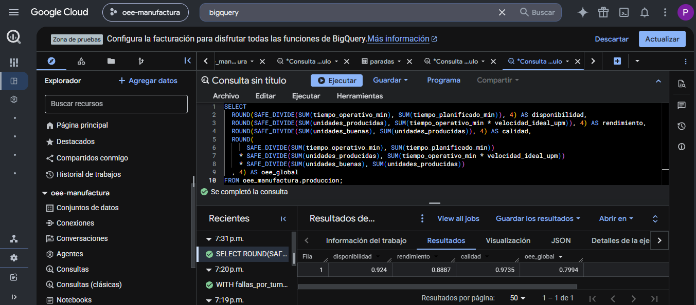
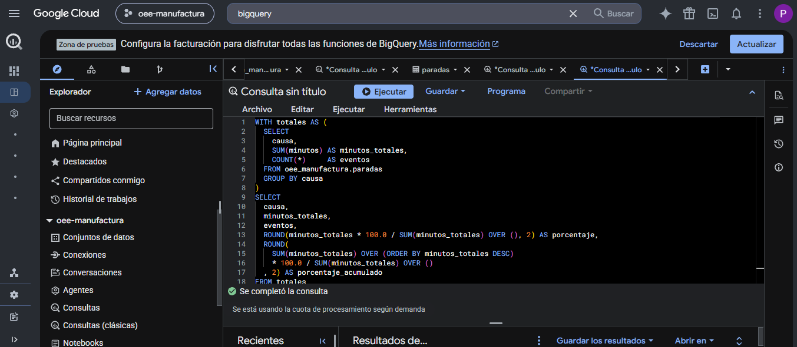
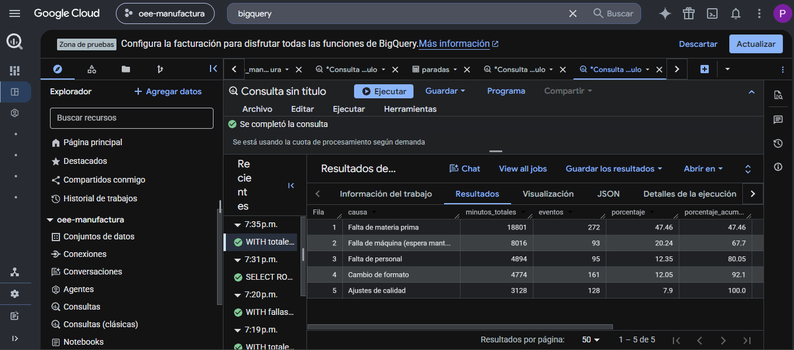
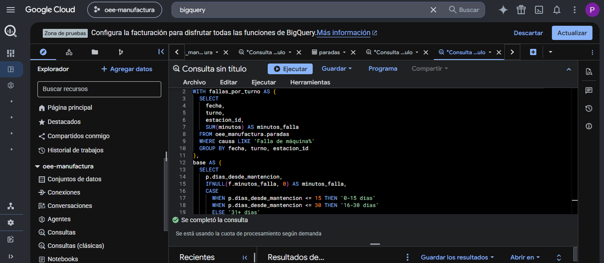
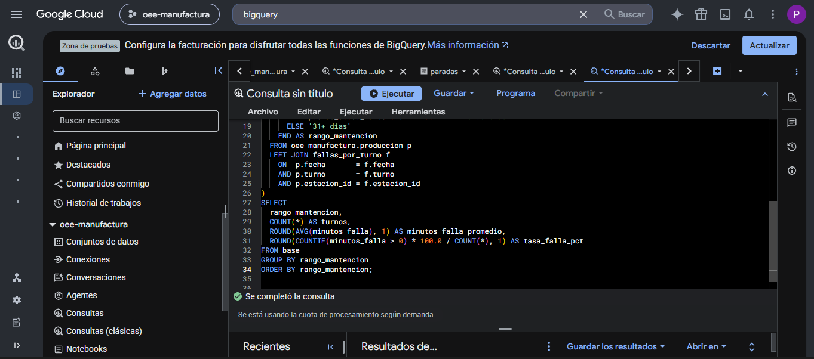
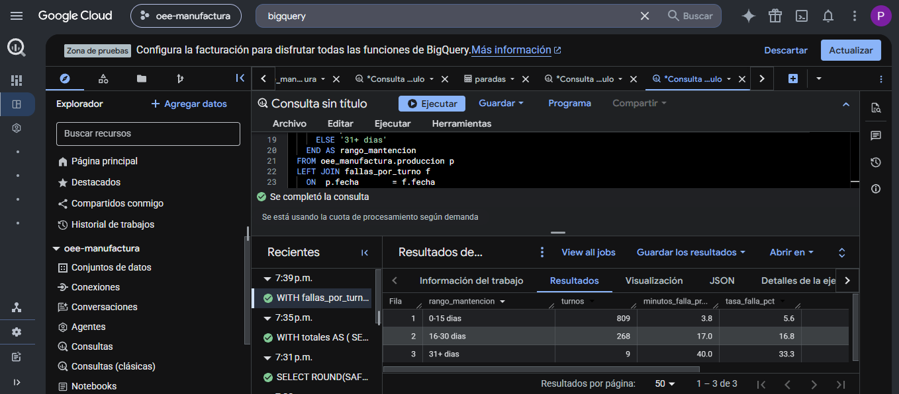

# Análisis de Eficiencia de Producción (OEE)

Pipeline completo de análisis de eficiencia productiva sobre una línea de manufactura
de dos estaciones: desde la generación del dataset hasta la validación en Google
BigQuery, pasando por modelado relacional, SQL analítico y dashboard.

**Hallazgo principal:** las máquinas sin mantención preventiva triplican su tasa de
falla, de 5,6% a 16,8%.

---

## Sobre los datos — 

> **Este proyecto usa un dataset simulado, y es una decisión deliberada.**

Los datos de producción de una planta real son confidenciales: ningún supervisor
puede publicar los registros de turno de su empleador. Simular el dataset es la
única forma de compartir públicamente un análisis de este tipo.

**Cómo se simuló:**

El generador (`generar_datos_oee.py`) no produce números al azar. Está parametrizado
con rangos operacionales realistas tomados de 14 años de experiencia en plantas
productivas:

| Parámetro | Valor usado | Por qué |
|---|---|---|
| Turnos por día | 3 | Régimen estándar de operación continua |
| Disponibilidad base | ~92% | Rango habitual en manufactura discreta |
| Tasa de defectos | ~2,6% | Coherente con procesos con control en línea |
| Causas de parada | 5 categorías | Las que efectivamente aparecen en un reporte de turno |
| Relación mantención–falla | degradación progresiva | El comportamiento físico esperado de un equipo |

**Qué demuestra este proyecto y qué no:**

✅ **Sí demuestra:** construcción de un pipeline de punta a punta, modelado relacional,
SQL analítico con CTEs y funciones de ventana, migración a la nube con validación
cruzada, y traducción de un hallazgo técnico a una recomendación operacional.

❌ **No demuestra:** un hallazgo generalizable sobre la industria. Los números salen
de un dataset construido; la relación entre mantención y falla está en los datos
porque se parametrizó para que estuviera. Lo que el análisis demuestra es que el
pipeline **la detecta y la cuantifica correctamente**.

*Para un análisis sobre datos públicos reales, ver
[accidentabilidad-industrial-chile](https://github.com/PatricioAhumadaBustos/accidentabilidad-industrial-chile).*

---

## El escenario

Una línea de manufactura con dos estaciones críticas donde las paradas no
planificadas afectan la producción, sin datos consolidados que permitan priorizar
intervenciones. Las causas sospechadas:

- **Desabastecimiento** de materia prima
- **Fallas de máquina** por mantención correctiva, sin esquema preventivo

**La pregunta:** ¿cuál de las dos cuesta más, y qué evidencia se necesita para
justificar el cambio a mantención preventiva?

---

## Metodología

### El dataset

6 meses de operación: 181 días × 3 turnos × 2 estaciones, con **1.086 registros de
producción** y **749 eventos de parada**.

Cada registro incluye tiempos planificados y operativos, unidades producidas,
defectuosas y buenas, historial de mantención por equipo, y causa de parada
clasificada.

### Cálculo del OEE

```
OEE = Disponibilidad × Rendimiento × Calidad

Disponibilidad = Tiempo Operativo / Tiempo Planificado
Rendimiento    = Unidades Producidas / (Tiempo Operativo × Velocidad Ideal)
Calidad        = Unidades Buenas / Unidades Producidas
```

### Análisis

1. **Pareto de causas** — qué concentra el mayor porcentaje de minutos perdidos
2. **Cruce mantención–falla** — relación entre días desde la última intervención y
   la tasa y duración de fallas
3. **Recomendación cuantificada** — el caso para migrar de correctivo a preventivo

---

## Hallazgos

### OEE global: 79,9%

| Componente | Valor |
|---|---|
| Disponibilidad | 92,4% |
| Rendimiento | 88,9% |
| Calidad | 97,4% |

### Dónde se pierden los minutos

| Causa | Minutos | % del total |
|---|---|---|
| Falta de materia prima | 18.801 | 60% |
| Fallas de máquina | 8.016 | 26% |

### El hallazgo crítico: la mantención

| Días sin mantención | Turnos | Min. falla promedio | Tasa de falla |
|---|---|---|---|
| 0–15 días | 809 | 3,8 | **5,6%** |
| 16–30 días | 268 | 17,0 | **16,8%** |
| 31+ días | 9 | 40,0 | 33,3% |

**La tasa de falla se triplica** al pasar de equipos recién intervenidos a equipos
con más de dos semanas sin mantención.

> **Nota metodológica:** la conclusión se sustenta en la comparación entre las dos
> primeras franjas, que concentran 1.077 de los 1.086 turnos observados. La franja
> de 31+ días refuerza la tendencia, pero con solo 9 observaciones no es
> estadísticamente concluyente por sí sola.

### Recomendación

Migrar a un esquema de **mantención preventiva** con intervención antes de los 15
días. El análisis muestra que ese es el umbral donde la tasa de falla se dispara.

---

## Migración a Google Cloud (BigQuery)

El análisis se replicó completo en BigQuery para validarlo en un entorno de nube:
mismo modelo de datos, consultas reescritas a GoogleSQL.

**Proceso:**
1. Proyecto en GCP con BigQuery Sandbox
2. Dataset `oee_manufactura` (región `southamerica-west1`)
3. Carga de las tablas `produccion` (1.086 filas) y `paradas` (749 filas) con
   detección automática de esquema
4. Reescritura de consultas a GoogleSQL: `SAFE_DIVIDE`, `COUNTIF`, `FORMAT_DATE`

### Validación cruzada: SQLite vs BigQuery

| Métrica | SQLite | BigQuery | Diferencia |
|---|---|---|---|
| Disponibilidad | 92,40% | 92,40% | 0,00 pp |
| Rendimiento | 88,90% | 88,87% | 0,03 pp |
| Calidad | 97,40% | 97,35% | 0,05 pp |
| **OEE Global** | **79,90%** | **79,94%** | **0,04 pp** |

Las diferencias están en el orden del redondeo. **La migración preservó tanto la
integridad de los datos como la lógica de cálculo** — que es exactamente lo que una
validación cruzada tiene que demostrar.








---

## Técnicas SQL aplicadas

- **CTEs (`WITH`)** para estructurar el análisis en pasos legibles
- **Funciones de ventana (`SUM() OVER`)** para el porcentaje acumulado del Pareto
- **`LEFT JOIN`** entre producción y paradas, preservando los turnos sin fallas —
  clave para no sesgar el cálculo de la tasa de falla: un `INNER JOIN` habría
  descartado justamente los turnos buenos, inflando la tasa
- **`SAFE_DIVIDE`** para manejo seguro de divisiones por cero

Consultas completas en `consultas_bigquery_oee.sql`.

---

## Estructura

```
oee-manufacturing-analysis/
├── generar_datos_oee.py          # Generador parametrizado del dataset
├── produccion.csv                # 1.086 registros turno-estación
├── paradas.csv                   # 749 eventos de parada
├── consultas_bigquery_oee.sql    # Consultas en GoogleSQL
├── bigquery_*.png                # Evidencia de la ejecución en BigQuery
└── README.md
```

## Cómo ejecutar

```bash
git clone https://github.com/PatricioAhumadaBustos/oee-manufacturing-analysis
cd oee-manufacturing-analysis
pip install pandas numpy

# Regenerar el dataset
python generar_datos_oee.py
```

Genera `produccion.csv` y `paradas.csv`. Los parámetros de simulación están al
inicio del script y pueden ajustarse para modelar otra línea.

**Requisitos:** Python 3.8+, pandas, numpy

---

## Limitaciones declaradas

- **El dataset es simulado.** Ver la sección [Sobre los datos](#sobre-los-datos--léelo-primero).
- **La franja de 31+ días tiene 9 observaciones.** Se reporta porque refuerza la
  tendencia, pero la conclusión no descansa en ella.
- **El OEE no considera pérdidas por arranque ni cambios de formato**, que en una
  línea real pueden ser significativas.
- **La velocidad ideal se asume constante** por estación. En una línea real varía
  según el formato de producto.

---

## Fases del proyecto

| Fase | Contenido |
|---|---|
| 1 | Generación del dataset parametrizado en Python |
| 2 | Modelado relacional y carga en SQLite |
| 3 | Análisis exploratorio (EDA) y visualizaciones |
| 4 | Dashboard interactivo en Power BI |
| 5 | Migración y validación cruzada en Google BigQuery |
| 6 | Documentación y publicación |

---

## Autor

**Patricio Ahumada Bustos** — Analista de Datos | Ingeniero en Automatización y Control Industrial

14 años en operaciones industriales, 8 como Supervisor de Producción. Este proyecto
nace de una pregunta que me hice muchas veces en planta: *¿cuánto nos está costando
realmente esperar a que la máquina falle?*

[LinkedIn](https://linkedin.com/in/patricio-ahumada-bustos) · [GitHub](https://github.com/PatricioAhumadaBustos)

**Stack:** Python · pandas · NumPy · SQL · SQLite · BigQuery (GCP) · Power BI · Git
